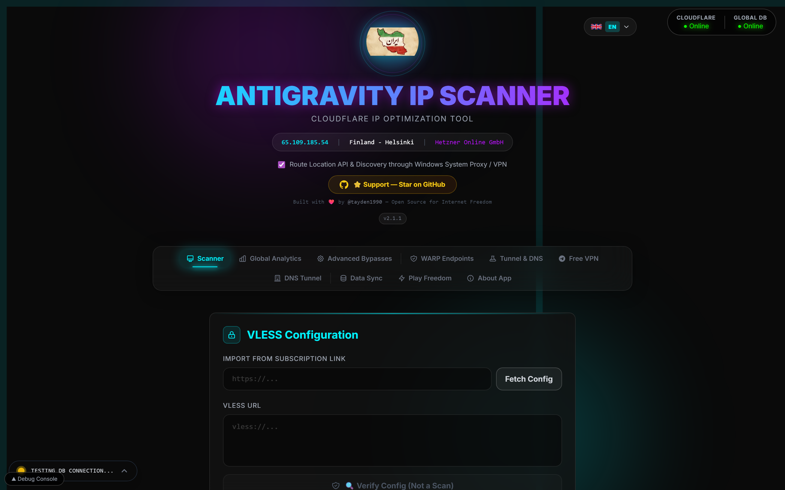
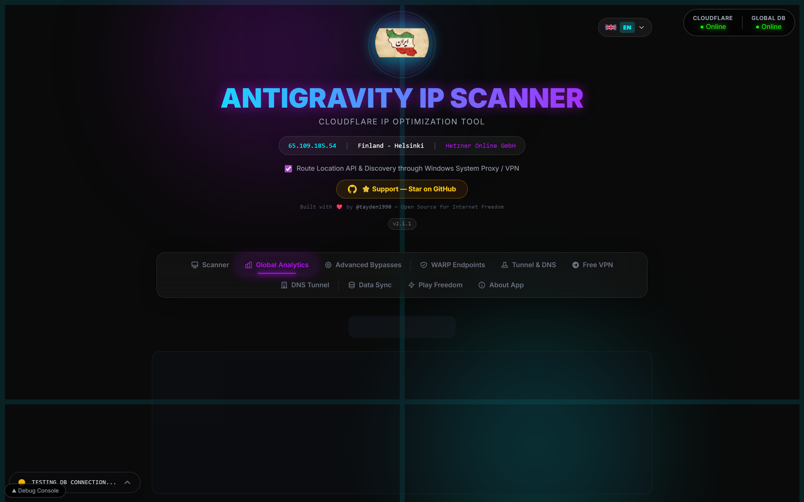
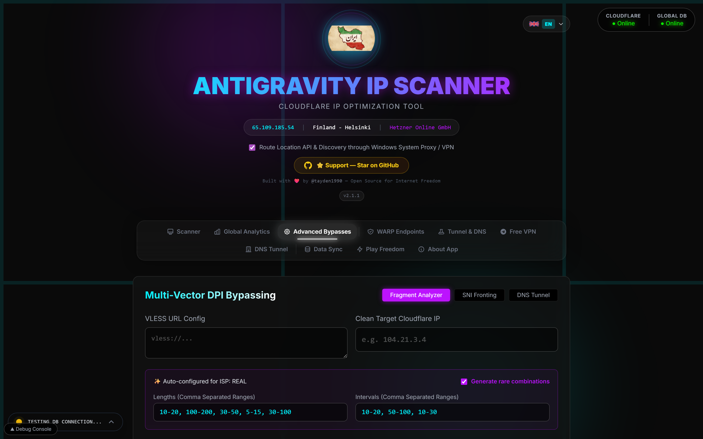
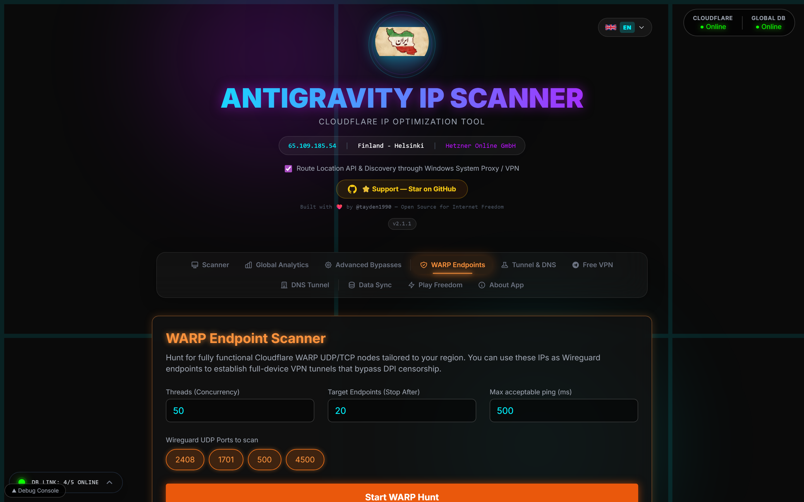
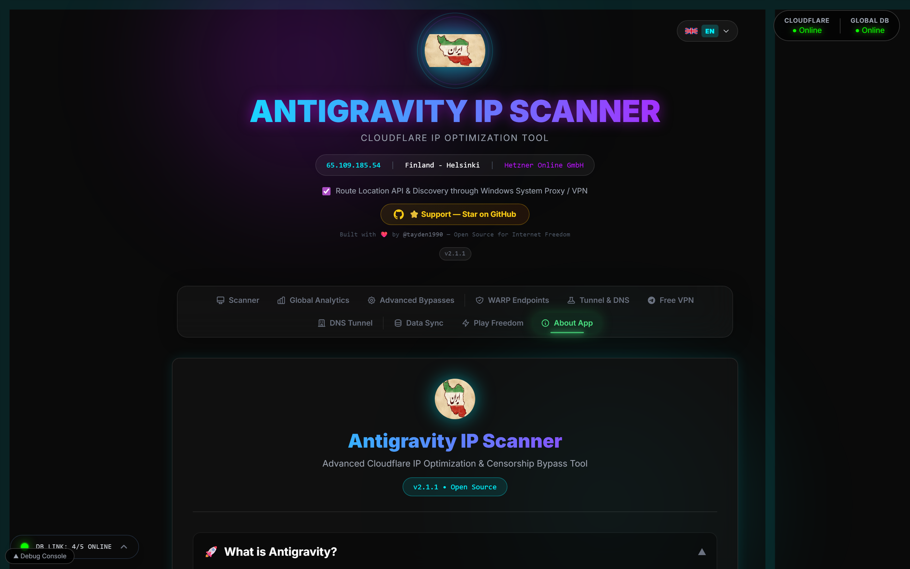

<div align="center">
  
  <h1>🚀 Antigravity IP Scanner</h1>
  <p><strong>Advanced Cloudflare IP Optimization & Censorship Bypass Tool</strong></p>
  <p>
    <a href="#-quick-start"></a>
    <a href="https://github.com/Khate-Tire/CF-IP-Scanner/stargazers"></a>
    <a href="LICENSE"></a>
    <a href="https://t.me/ANTIGRAVITY_IP"></a>
  </p>
  <p>
    
    
    
    
    
  </p>
</div>

---

<details>
<summary>🇮🇷 <strong>فارسی (Persian)</strong> — کلیک کنید</summary>

## اسکنر آی‌پی آنتی‌گرویتی

ابزار حرفه‌ای برای کشف و بهینه‌سازی آی‌پی‌های کلادفلر و دور زدن سانسور اینترنت.

### ✨ ویژگی‌ها
- 📡 تست پینگ، جیتر و سرعت دانلود/آپلود واقعی
- 🧩 آنالیز فرگمنت DPI و SNI فرانتینگ
- 📡 اسکنر نقاط WARP (وایرگارد/UDP)
- � موتور Play Freedom — کشف خودکار کانفیگ‌های VPN بدون دخالت کاربر
- 📱 داشبورد VPN رایگان با احراز هویت تلگرام
- 🧠 پیشنهادات هوشمند تنظیمات اسکن بر اساس پروفایل شبکه شما
- 💾 پشتیبان‌گیری و بازیابی کامل با رمزنگاری AES-256 (فرمت .agdb)
- 📴 حالت آفلاین — آنالیتیکس، جغرافیا و کانفیگ‌ها بدون اینترنت
- 🔗 پایگاه داده ۵ لایه‌ای مقاوم (MySQL → Worker → SQLite)
- 🔄 تست مجدد آی‌پی‌های ناموفق با یک کلیک
- �🌍 نقشه حرارتی جهانی با آمار لحظه‌ای
- 🔒 تأیید TLS سخت (ضد حمله وسط)
- 🏆 سیستم آی‌پی طلایی هوشمند
- 🌐 پشتیبانی چندزبانه (انگلیسی، فارسی، روسی)

### 🚀 شروع سریع
```bash
git clone https://github.com/Khate-Tire/CF-IP-Scanner.git
cd CF-IP-Scanner
pip install -r backend/requirements.txt
python run_app.py
```

### 📱 ارتباط
- 🤖 ربات تلگرام: [@antigravity_ip_bot](https://t.me/antigravity_ip_bot)
- 💬 گروه تلگرام: [@ANTIGRAVITY_IP](https://t.me/ANTIGRAVITY_IP)
- 👨‍💻 توسعه‌دهنده: [@hossein_shiravani](https://t.me/hossein_shiravani)

</details>

<details>
<summary>🇷🇺 <strong>Русский (Russian)</strong> — Нажмите</summary>

## Antigravity IP Сканер

Профессиональный инструмент для поиска и оптимизации IP-адресов Cloudflare и обхода интернет-цензуры.

### ✨ Возможности
- 📡 Тестирование пинга, джиттера и реальной скорости загрузки/выгрузки
- 🧩 Анализатор DPI-фрагментации и SNI-фронтинг
- 📡 Сканер точек WARP (Wireguard/UDP)
- � Движок Play Freedom — автоматический поиск рабочих VPN-конфигов без участия пользователя
- 📱 Панель бесплатного VPN с Telegram-авторизацией
- 🧠 Умные рекомендации настроек сканирования на основе профиля вашей сети
- 💾 Полное резервное копирование и импорт с AES-256 шифрованием (формат .agdb)
- 📴 Офлайн-режим — аналитика, гео-данные и конфиги без интернета
- 🔗 5-уровневая устойчивая БД (MySQL → Worker → SQLite)
- 🔄 Повторный тест неудачных IP одним кликом
- �🌍 Глобальная тепловая карта со статистикой в реальном времени
- 🔒 Строгая проверка TLS (защита от MITM)
- 🏆 Умная система золотых IP
- 🌐 Мультиязычная поддержка (EN, FA, RU)

### 🚀 Быстрый старт
```bash
git clone https://github.com/Khate-Tire/CF-IP-Scanner.git
cd CF-IP-Scanner
pip install -r backend/requirements.txt
python run_app.py
```

### 📱 Связь
- 🤖 Telegram бот: [@antigravity_ip_bot](https://t.me/antigravity_ip_bot)
- 💬 Telegram группа: [@ANTIGRAVITY_IP](https://t.me/ANTIGRAVITY_IP)
- 👨‍💻 Разработчик: [@hossein_shiravani](https://t.me/hossein_shiravani)

</details>

---

## 📸 Screenshots

<div align="center">

### 🔍 Scanner — Main Interface

<br/><em>The main scanner with VLESS configuration, IP source selection, and one-click auto scan</em>

---

### 🌍 Global Analytics — World Heatmap

<br/><em>Real-time global network health map with country-level statistics</em>

---

### 🧩 Advanced Bypasses — DPI & SNI

<br/><em>Multi-vector DPI bypassing with fragment analysis and SNI fronting</em>

---

### 📡 WARP Endpoints — Wireguard Scanner

<br/><em>Hunt for Cloudflare WARP UDP/TCP endpoints for full-device VPN tunnels</em>

---

### ℹ️ About App — Documentation

<br/><em>Built-in guide, FAQ, system requirements, and privacy policy</em>

</div>

---

## ✨ Features

| Feature | Description |
|---------|-------------|
| 🔍 **IP Scanner** | Discover clean Cloudflare Edge IPs with real ping, jitter, download & upload speed tests |
| ⚡ **Fastly CDN** | Full native support for scanning Fastly Edge networks alongside Cloudflare |
| 🏆 **Gold IPs** | Smart history + community-verified IPs + auto top-domain discovery |
| 👥 **Community Gold** | IPs verified by other users in your region — shared intelligence |
| 🧩 **DPI Fragment Analyzer** | Test every length/interval permutation to bypass Deep Packet Inspection |
| 🛡️ **DNSTT & Split-Stream** | Dedicated beta scanner for SlowDNS encapsulation and TLS split packets |
| 🌐 **SNI Fronting** | Scan hundreds of SNIs against a working IP to find unblocked routes |
| 📡 **WARP Scanner** | Find functional WARP UDP endpoints for Wireguard-based VPN tunnels |
| 🎯 **Play Freedom** | Autonomous 4-phase engine that discovers working VPN configs without user intervention |
| 📱 **Free VPN Dashboard** | Telegram-authenticated dashboard for free community VPN configs |
| 🧠 **Smart Recommendations** | Intelligent panel suggesting optimal scan settings based on your network profile |
| 💾 **Data Transfer** | Full backup & import with 10 data categories in AES-256 encrypted `.agdb` format |
| 📴 **Offline Mode** | Analytics, geo data, configs, and bypass profiles all work offline via local cache |
| 🔗 **5-Layer DB Resilience** | Direct MySQL → Worker proxy → Worker+fronting → VLESS tunnel → Local SQLite |
| 🔄 **Dropped IP Re-test** | Failed IPs shown in results table with one-click re-test button (no thresholds) |
| 🗺️ **Global Heatmap** | Interactive world map with country-level scan analytics |
| 🔒 **TLS Verification** | Anti-MITM certificate validation for Cloudflare connections |
| ⚡ **TCP Pre-Filter** | Blazing-fast 1000ms dead-IP drop before heavy Xray scanning begins |
| 💾 **Persistent Queue** | Pure SQLite async queue ensures scans survive app restarts |
| 🔄 **Smart Retry** | Auto-relaxes thresholds if strict settings find nothing |
| 📊 **Real-time Analytics** | Live charts for datacenter latency, port success, and network protocols |
| 🌐 **Multi-Language** | Full UI in English 🇬🇧, فارسی 🇮🇷, and Русский 🇷🇺 |
| 📱 **Deep Links** | One-click export to V2RayNG, Hidify, V2Box, Clash Meta, Sing-box |
| 🌐 **DNS Override** | Route DNS queries through encrypted DoH/DoT servers to bypass ISP poisoning |
| 🍎 **macOS Support** | Native DMG installer for macOS alongside Windows EXE |

---

## 🚀 Quick Start

### Supported Platforms

| Platform | Status | Install |
|----------|--------|------|
| 🪟 **Windows 10/11** | ✅ Full Support | Download `.exe` from [Releases](https://github.com/Khate-Tire/CF-IP-Scanner/releases) |
| 🍎 **macOS** | ✅ Full Support | Download `.dmg` from [Releases](https://github.com/Khate-Tire/CF-IP-Scanner/releases) |
| 🐧 **Linux** | ✅ Manual Setup | See [LINUX_INSTALL.md](LINUX_INSTALL.md) |
| 📱 **Termux (Android)** | ⚠️ Experimental | [Termux Guide](LINUX_INSTALL.md#-termux-android--experimental) |

### Prerequisites

- **Python 3.10+**
- **Node.js 18+** (for development)
- Internet connection

### Installation

```bash
# Clone the repository
git clone https://github.com/Khate-Tire/CF-IP-Scanner.git
cd CF-IP-Scanner

# Install Python dependencies
pip install -r backend/requirements.txt

# Run the application
python run_app.py
```

The app will open at `http://localhost:5173` with the backend API on port `8000`.

### Development Mode

```bash
# Frontend (Terminal 1)
cd frontend
npm install
npm run dev

# Backend (Terminal 2)
cd backend
python main.py
```

### Build Desktop App

```bash
# Build Electron executable
npm run build
npm run dist
```

---

## 🏗️ Architecture

```
CF-IP-Scanner/
├── backend/                 # Python FastAPI backend
│   ├── main.py             # API server & all routes
│   ├── scanner.py          # Core IP scanning engine (VLESS/VMess/Trojan)
│   ├── warp_scanner.py     # WARP endpoint scanner (UDP/TCP)
│   ├── freedom_engine.py   # Play Freedom autonomous config engine
│   ├── db.py               # 5-layer DB fallback (MySQL → Worker → SQLite)
│   ├── db_proxy.py         # Cloudflare Worker DB proxy client
│   ├── offline_db.py       # Encrypted .agdb backup/restore (AES-256)
│   ├── discovery.py        # Auto-scrape top domains per country
│   ├── export.py           # Config export (V2RayNG, Clash, Sing-box)
│   ├── cf_ips.py           # Cloudflare & Fastly IP range manager
│   ├── core_manager.py     # Xray-core process lifecycle
│   ├── local_queue.py      # Persistent SQLite async scan queue
│   └── xray_core/          # Bundled Xray-core binary
├── frontend/                # React + Vite + Tailwind CSS
│   ├── src/
│   │   ├── App.jsx         # Main application (10 tabs)
│   │   ├── api.js          # Backend API client
│   │   ├── components/
│   │   │   ├── ConfigInput.jsx          # Config + scan settings
│   │   │   ├── ResultsTable.jsx         # Results with dropped IP re-test
│   │   │   ├── AnalyticsDashboard.jsx   # Charts & datacenter stats
│   │   │   ├── WorldHeatmap.jsx         # Interactive global heatmap
│   │   │   ├── GeoMap.jsx               # Country-level geo analytics
│   │   │   ├── AdvancedScanners.jsx     # DPI fragment & SNI fronting
│   │   │   ├── FragmentChart.jsx        # Fragment analysis visualization
│   │   │   ├── WarpScanner.jsx          # WARP endpoint scanner
│   │   │   ├── DnsScanner.jsx           # DNSTT & split-stream scanner
│   │   │   ├── DnsScannerGuide.jsx      # DNS scanner guide
│   │   │   ├── FreeVpnDashboard.jsx     # Free VPN with Telegram auth
│   │   │   ├── FreedomWidget.jsx        # Play Freedom status & controls
│   │   │   ├── DataTransferPanel.jsx    # Full backup/import (.agdb)
│   │   │   ├── SmartRecommendationPanel.jsx # Smart scan recommendations
│   │   │   ├── HealthWidget.jsx         # Backend health monitor
│   │   │   ├── DBStatusBar.jsx          # DB connection status bar
│   │   │   ├── StatsPanel.jsx           # Live scan statistics
│   │   │   ├── LogBox.jsx               # Real-time scan logs
│   │   │   ├── AboutBox.jsx             # Documentation & FAQ
│   │   │   ├── LanguageSwitcher.jsx     # EN/FA/RU language picker
│   │   │   └── UpdateModal.jsx          # Auto-update notification
│   │   └── i18n/           # Internationalization
│   │       ├── LanguageContext.jsx
│   │       ├── en.json     # English
│   │       ├── fa.json     # فارسی (Persian)
│   │       └── ru.json     # Русский (Russian)
│   └── public/
│       └── logo.png
├── worker/                  # Cloudflare Worker DB proxy
│   ├── src/index.js        # Worker entry point
│   └── wrangler.toml       # Worker configuration
├── docs/
│   └── screenshots/        # App screenshots
├── main.js                  # Electron main process
├── run_app.py              # One-click launcher
├── LICENSE                  # GNU AGPLv3 License
├── CITATION.cff            # Citation metadata
└── README.md               # This file
```

---

## 🌐 Internationalization (i18n)

Antigravity supports **3 languages** with automatic font switching:

| Language | Code | Font | Direction |
|----------|------|------|-----------|
| 🇬🇧 English | `en` | Inter | LTR |
| 🇮🇷 فارسی | `fa` | Vazirmatn | RTL |
| 🇷🇺 Русский | `ru` | Nunito | LTR |

### Adding a New Language

1. Duplicate `frontend/src/i18n/en.json` → `xx.json`
2. Translate all ~250 keys
3. Import in `LanguageContext.jsx`:
   ```js
   import xx from './xx.json';
   const locales = { en, fa, ru, xx };
   ```
4. Add to `LANGUAGES` array:
   ```js
   { code: 'xx', name: 'Language', flag: '🏳️' }
   ```

---

## 🔧 Configuration

### IP Sources

| Source | Description |
|--------|-------------|
| **Official Cloudflare** | Random IPs from Cloudflare's published ranges |
| **Smart History** | Previously successful IPs for your specific ISP |
| **Gold IPs** | Smart History + auto-scraped top domains for your country |
| **Community Gold** | Best IPs verified by any user in your geographic region |
| **Auto-Scrape** | Clean IPs from community GitHub lists |
| **Custom URL** | Your own private IP list |

### Strictness Profiles

| Profile | Max Ping | Max Jitter | Min Download | Min Upload |
|---------|----------|------------|-------------|------------|
| 🛡️ Minimum | 1500ms | 800ms | 0.1 Mbps | 0.1 Mbps |
| ⚖️ Average | 600ms | 300ms | 2 Mbps | 0.5 Mbps |
| ⚡ Hard | 300ms | 100ms | 10 Mbps | 2 Mbps |

---

## 🔒 Privacy & Security

- ✅ VLESS configs are **NEVER uploaded** — they stay 100% local
- ✅ Scan results (IP, ping, speed) are optionally shared to help the community
- ✅ All tests route through **Cloudflare's own infrastructure**
- ✅ Your public IP is detected via ip-api.com solely for ISP matching
- ✅ **No analytics trackers, no ads, no telemetry** — fully open source
- ✅ Optional TLS certificate validation prevents MITM attacks

---

## 🤝 Contributing

We welcome contributions! See [CONTRIBUTING.md](CONTRIBUTING.md) for guidelines.

```bash
# Fork & clone
git clone https://github.com/YOUR_USERNAME/CF-IP-Scanner.git

# Create a feature branch
git checkout -b feature/amazing-feature

# Make your changes & commit
git commit -m "feat: add amazing feature"

# Push & create a Pull Request
git push origin feature/amazing-feature
```

---

## 📜 License

This project is licensed under the **GNU AGPLv3 License** — see the [LICENSE](LICENSE) file for details.

---

## 📖 Citation

If you use this tool in your research, please cite it:

```bibtex
@software{antigravity_ip_scanner,
  author = {Akbari Saeed, Taher},
  title = {Antigravity IP Scanner: Advanced Cloudflare IP Optimization \& Censorship Bypass Tool},
  year = {2024},
  url = {https://github.com/Khate-Tire/CF-IP-Scanner},
  license = {AGPL-3.0}
}
```

---

## 👨‍💻 Author & Contact

<div align="center">

| | |
|---|---|
| 👤 **Name** | Khate Tire |
| 📧 **Email** | khatetire@proton.me |
| 🐙 **GitHub** | [@Khate-Tire](https://github.com/Khate-Tire) |
| ✈️ **Telegram** | [@hossein_shiravani](https://t.me/hossein_shiravani) |
| 🆔 **ORCID** | [0000-0002-9517-9773](https://orcid.org/0000-0002-9517-9773) |

</div>

---

## 🌟 Community

- ⭐ **[Star this repo](https://github.com/Khate-Tire/CF-IP-Scanner)** — Support open-source internet freedom
- 🤖 **[Telegram Bot](https://t.me/antigravity_ip_bot)** — Get free VPN configs instantly
- 💬 **[Telegram Group](https://t.me/ANTIGRAVITY_IP)** — Join the community, share feedback

---

<div align="center">
  <p><strong>🕊️ Built for a free and open internet</strong></p>
  <p><sub>Antigravity IP Scanner v2.0.65 • © 2024-2025 Khate Tire • GNU AGPLv3 License</sub></p>
</div>
